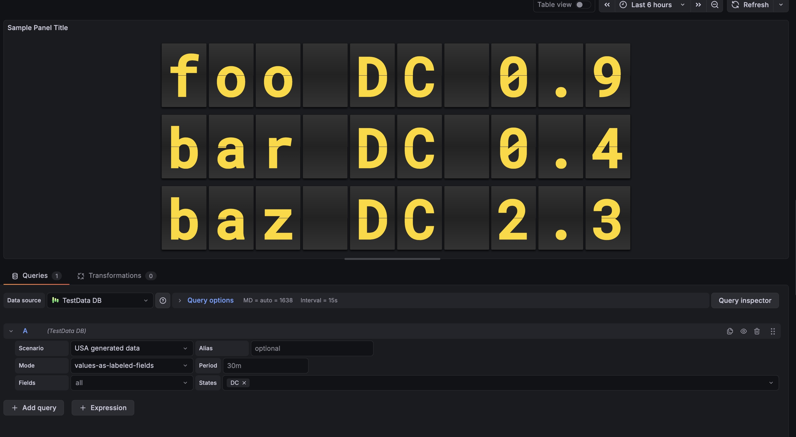

# Split Flap Panel for Grafana


Basically, it's a retro **Split Flap** (or Solari board) display for your Grafana dashboards. Gives you that classic airport terminal vibe, but runs smooth in the browser.

## Features

### 🕒 Clock Mode
Turn your dashboard into a stylish world clock.
- **Standalone**: Does not require any data source.
- **Timezones**: Support for all major world timezones (400+ timezones available).
- **Formats**: 12h/24h options, show/hide seconds.
- **Time Separator**: Choose between Colon (:), Dot (.), Dash (-), Space ( ), or None.
- **Date Format**: Optional date display (DD/MM/YYYY, MM/DD/YYYY, YYYY-MM-DD, DD.MM.YYYY).
- **Day of Week**: Optionally display the current day name (short format).

### 🔄 Smart Animation
The flip logic isn't just random:
- **Numbers**: Flip fast using a numeric-only path (e.g., 1 -> 2 is quick).
- **Text**: Goes through the full alphabet cycle, just like the real mechanical ones.
- **Physics**: Long flips accelerate and then slow down at the end (easing).

### 🎨 Themes
Comes with a bunch of built-in styles so you don't have to write CSS:

| Theme | Description | Best For |
|-------|-------------|----------|
| **Classic** | Standard dark grey, flat look. | General use |
| **Classic 3D** | Like Classic but with more depth and shadows. | Realistic look |
| **Aviation: Departure** | Classic airport board style with yellow text on black. | Flight departure boards |
| **Aviation: Cockpit** | Technical instrument style with cyan text. | Aircraft cockpits |
| **Aviation: Tarmac** | Orange/amber high-visibility style. | Ground operations |
| **Swiss SBB: Black** | Swiss railway black display style. | Transportation |
| **Swiss SBB: White** | Swiss railway white display style. | Transportation |
| **Swiss SBB: Blue** | Swiss railway blue with red border. | Transportation |
| **Airport** | Gold text on black background. | Flight boards |
| **Mechanical** | White/Metal industrial style. | IoT / Machinery |
| **Cyberpunk** | Neon cyan with CRT scanlines. | Sci-fi dashboards |
| **Matrix** | Actual digital rain animation in the background. | Hacker vibes |
| **Neon** | Dark background with heavy text glow. | Night mode |
| **E-Ink** | High contrast, paper-like with vignette. | E-readers look |
| **Glass** | Frosted glass effect with transparency. | Modern UI |
| **Blue Glass** | Blue-tinted glass effect. | Modern UI |
| **Rainbow** | Colorful gradient display. | Colorful dashboards |
| **Newspaper** | Halftone newspaper print style. | Vintage look |
| **iOS Light** | Apple iOS light mode style. | Modern Apple-style UI |
| **iOS Dark** | Apple iOS dark mode style. | Modern Apple-style UI |
| **Wood** | Wooden texture style. | Natural/organic look |
| **Red 3D** | Red 3D gradient style. | Alerts / Warnings |

### 🔤 Fonts

Most themes use standard system fonts for best performance. However, **Aviation** themes automatically load specialized fonts from **Google Fonts** to maintain the authentic look:

- **Oswald**: Used in `Aviation: Departure` (Classic airport board style).
- **Share Tech Mono**: Used in `Aviation: Cockpit` (Technical instrument style).

*Note: If your Grafana instance is offline (air-gapped), these themes will automatically fallback to standard system fonts (Arial, Consolas) and will still be fully functional.*

### 📊 Data Options

| Option | What it does |
|--------|--------------|
| **Value Aggregation** | Pick what to show from the series: `Last`, `First`, `Min`, `Max`, `Mean`, `Sum`, `Count`, etc. |
| **Main Content** | Choose what goes on the flaps: `Value`, `Name`, `Name + Value`, or `Value + Name`. |
| **Auto Fit** | Automatically calculates the best card size to fit the panel. Turn off for fixed size. |
| **Name Position** | Position of series name: Top, Bottom, Left, or Right. |
| **Name Alignment** | Alignment of series name: Start, Center, or End. |
| **Name Font Size** | Custom font size for series name (8-100px). |
| **Unit Position** | Position of unit: Top, Bottom, Left, Right, or None. |
| **Unit Alignment** | Alignment of unit: Start, Center, or End. |
| **Unit Rotation** | Rotate unit text 90 degrees. |
| **Custom Unit** | Override the unit with custom text. |
| **Unit Font Size** | Custom font size for unit (8-100px). |

## Examples

See the panel in action with different configurations:

### Default View

*Shows numeric values with the classic airport look.*

## Usage

1. **Add it**: Find "Split Flap" in the visualization list.
2. **Choose Mode**:
   - **Data Series**: Connect a data source to visualize metrics.
   - **Clock**: Display current time for any timezone (no data source needed).
3. **Tweak it**:
   - Change layout (Vertical/Horizontal).
   - Pick a theme that fits your dashboard.
   - Set up **Thresholds** to change colors dynamically (e.g., red when value > 80).

## Configuration

### Panel Options

| Setting | Description | Default |
|---------|-------------|---------|
| **Mode** | Choose between `Data Series` or `Clock`. | Data Series |
| **Layout** | Direction of the series grid (Horizontal / Vertical). | Horizontal |
| **Show Separators** | Draw lines between different series. | Off |
| **Theme** | Visual style of the flaps (see Themes section above). | Classic |
| **Show Name** | Display series name outside the flaps. | On |
| **Name Position** | Where to place the name: Top, Bottom, Left, or Right. | Top |
| **Name Alignment** | How to align the name: Start, Center, or End. | Center |
| **Name Font Size** | Font size for the name (8-100px). | 18 |
| **Show Unit** | Display unit outside the flaps. | On |
| **Unit Position** | Where to place the unit: Top, Bottom, Left, Right, or None. | Right |
| **Unit Alignment** | How to align the unit: Start, Center, or End. | Center |
| **Unit Rotation** | Rotate unit text 90 degrees. | Off |
| **Custom Unit** | Override the unit with custom text. | (empty) |
| **Unit Font Size** | Font size for the unit (8-100px). | 24 |
| **Threshold Target** | What to colorize: Text, Tile (card background), or Panel background. | None |

### Clock Options (Clock Mode Only)

| Setting | Description | Default |
|---------|-------------|---------|
| **12-Hour Format** | Use 12-hour format (AM/PM) instead of 24-hour. | Off |
| **Show Seconds** | Display seconds in the time. | On |
| **Timezone** | Select timezone (400+ available) or use browser local time. | Browser Local |
| **Show Timezone** | Display timezone name (e.g., "EST", "PST", "UTC") outside the clock. | Off |
| **Timezone Position** | Where to place the timezone: Top, Bottom, Left, or Right. | Bottom |
| **Timezone Alignment** | How to align the timezone: Start, Center, or End. | Center |
| **Timezone Font Size** | Font size for the timezone (8-100px). | 18 |
| **Time Separator** | Character between hours, minutes, seconds: Colon (:), Dot (.), Dash (-), Space ( ), or None. | Colon |
| **Date Format** | Optional date display format: DD/MM/YYYY, MM/DD/YYYY, YYYY-MM-DD, DD.MM.YYYY, or None. | None |
| **Show Day of Week** | Display abbreviated day name (Mon, Tue, etc.). | Off |

### Flip Options

| Setting | Description | Default |
|---------|-------------|---------|
| **Digits** | Minimum number of characters/cards to show. | 6 |
| **Rounding** | Decimal places for numbers. | 1 |
| **Auto Fit** | Auto-scale card size to fill the panel. | On |
| **Size (px)** | Fixed card height (if Auto Fit is off). | 50 |
| **Gap** | Space between individual cards. | 4 |
| **Speed** | Animation speed multiplier (0.1-2.0). | 0.6 |
| **Fast Speed** | Speed for quick number transitions (0.05-0.5). | 0.1 |

## Installation

### Manual
1. Grab the latest release zip.
2. Unzip it into your Grafana plugins folder (usually `/var/lib/grafana/plugins`).
3. Restart Grafana.

## Dev Setup

### 1. Install

```bash
npm install
```

### 2. Run in dev mode

```bash
npm run dev
```

### 3. Build for prod

```bash
npm run build
```
